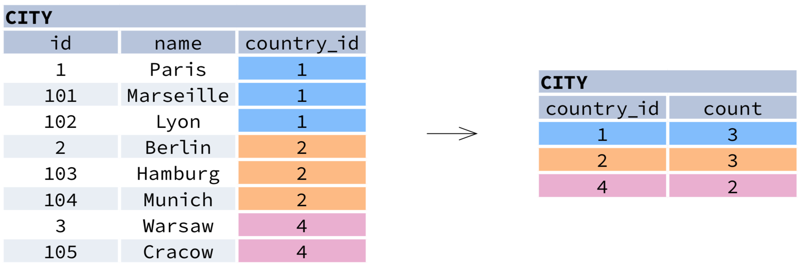

# databases-megak-course

**MySQL Collation:**
utf8mb4_unicode_ci

| What?       | Description                                   |
|-------------|-----------------------------------------------|
| **utf8mb4** | UTF8 implementation (1-4 bytes for character) |
| **unicode** | Unicode implementation                        |
| **ci**      | case insensitive                              |
|             | spaces are like no-spaces, "Ab " === "Ab"     |


#QUERYING SINGLE TABLE

Fetch all columns from the `country` table:
~~~~
SELECT *
FROM country;
~~~~

Fetch id and name columns from the `city` table:
~~~~
SELECT id, name
FROM city;
~~~~


Fetch city names sorted by the `rating` column in the default ASCending order:
~~~~
SELECT name
FROM city
ORDER BY rating [ASC];
~~~~


Fetch city names sorted by the `rating` column in the DESCending order:
~~~~
SELECT name
FROM city
ORDER BY rating DESC;
~~~~


#ALIASES

##COLUMNS
~~~~
SELECT name AS city_name
FROM city;
~~~~

##TABLES
~~~~
SELECT co.name, ci.name
FROM city AS ci
JOIN country AS co
ON ci.country_id = co.id;
~~~~

#FILTERING THE OUTPUT

##COMPARISON OPERATORS

Fetch names of cities that have a rating above 3:
~~~~
SELECT name
FROM city
WHERE rating > 3;
~~~~

Fetch names of cities that are neither Berlin nor Madrid:
~~~~
SELECT name
FROM city
WHERE name != 'Berlin'
AND name != 'Madrid';
~~~~

##TEXT OPERATORS

Fetch names of cities that start with a 'P' or end with an 's':
~~~~
SELECT name
FROM city
WHERE name LIKE 'P%'
OR name LIKE '%s';
~~~~

Fetch names of cities that start with any letter followed by 'ublin' (like Dublin in Ireland or Lublin in Poland):
~~~~
SELECT name
FROM city
WHERE name LIKE '_ublin';
~~~~

##OTHER OPERATORS

Fetch names of cities that have a population between 500K and 5M:
~~~~
SELECT name
FROM city
WHERE population BETWEEN 500000 AND 5000000;
~~~~

Fetch names of cities that don't miss a rating value:
~~~~
SELECT name
FROM city
WHERE rating IS NOT NULL;
~~~~

Fetch names of cities that are in countries with IDs 1, 4, 7, or 8:
~~~~
SELECT name
FROM city
WHERE country_id IN (1, 4, 7, 8);
~~~~


#AGGREGATION AND GROUPING

`GROUP BY` groups together rows that have the same values in specified columns. It computes summaries (aggregates) for each unique combination of values.



##AGGREGATE FUNCTIONS
`avg(expr)` − average value for rows within the group

`count(expr)` − count of values for rows within the group

`max(expr)` − maximum value within the group

`min(expr)` − minimum value within the group

`sum(expr)` − sum of values within the group

##EXAMPLE QUERIES

Find out the number of cities:
~~~~
SELECT COUNT(*)
FROM city;
~~~~

Find out the number of cities with non-null ratings:
~~~~
SELECT COUNT(rating)
FROM city;
~~~~

Find out the number of distinctive country values:
~~~~
SELECT COUNT(DISTINCT country_id)
FROM city;
~~~~

Find out the smallest and the greatest country populations:
~~~~
SELECT MIN(population), MAX(population)
FROM country;
~~~~

Find out the total population of cities in respective countries:
~~~~
SELECT country_id, SUM(population)
FROM city
GROUP BY country_id;
~~~~

Find out the average rating for cities in respective countries if the average is above 3.0:
~~~~
SELECT country_id, AVG(rating)
FROM city
GROUP BY country_id
HAVING AVG(rating) > 3.0;
~~~~

# Zagadnienia
---
## ==Z1.1== Node.js
Node.js jest środowiskiem uruchomieniowym (*runtime*) JavaScript zbudowanym na bazie silnika V8, wykorzystywanego w Chome. Pozwala na uruchomienie aplikacji JavaScriptowych poza przeglądarką. Jest jednowątkowy, nie-blokujący i asynchroniczny dzięki wykorzystaniu pętli zdarzeń. ([źródło](https://intro-to-nodejs-v2-site.vercel.app/lesson/01-what-is-node))

Jest wykorzystywany do:
- serwerów i API (może obłużyć wiele requestów)
- baz danych
- CLI - Command Line Interface
- build tools
- automatyzacji
- skryptów
- botów

Niezbyt dobrze nadaje się do operacji wymagających dużego wykorzystania CPU ([źródło](https://frontendmasters.com/courses/node-js-v2/testing-an-api-with-httpie/)):
- arytmetyka
- sztuczna inteligencja
- uczenie maszynowe

**nvm** jest narzędziem do zarządzania wersją Node.js.

---
## ==Z1.2== Global object
### Zmienne wyglądające na globalne i zakres modułu
W przeglądarce, zakres najwyższego poziomu to zakres globalny. Wykorzystanie `var something` na najwyższym poziomie zdefiniuje nową zmienną globalną. W Node.js najwyższy poziom to zakres modułu. Wykorzystanie `var something` w module Node.js zdefiniuje zmienną lokalną do tego modułu. Jest to osiągnięte za pomocą opakowania całego kodu z pliku w funkcję (*module wrapper*). Udostępnia to w każdym module CJS kilka zmiennych wyglądających na globalne: `exports`, `require`, `module`, `__filename`, `__dirname`. Te zmienne **nie** są dostępne w modułach ES! **Nie są one globalne** (wbrew temu co było powiedziane na FrontendMasters, [źródło](https://nodejs.org/api/globals.html#global-objects))!

### Obiekt globalny
Oprócz tego, istnieje obiekt `global`, odpowiednik `window` w przeglądarce, dostępny zarówno w modułach ESM i CJS.

Zawiera klucze ([źródło](https://nodejs.org/api/globals.html)): `global` (referencja cykliczna), `AbortController`, `AbortSignal`, `Buffer`, `clearImmediate()`, `clearInterval()`, `clearTimeout()`, `console`, `Event`, `EventTarget`, `fetch()` (eksperymentalne i schowane za flagą `--experimental-fetch` wraz z `Headers`, `Response`, `Request`), `MessageChannel`, `MessageEvent`, `MessagePort`, `performance`, `process`, `queueMicrotask()`,  `setImmediate()`, `setInterval()`, `setTimeout()`, `structuredClone()`, `DOMException`, `TextDecoder`, `TextEncoder`, `URL`, `URLSearchParams`, `WebAssembly`.

Z każdej z tych właściwości możemy skorzystać również bez zapisania `global.` jako przedrostek (same w sobie **są obiektami globalnymi**).

### Standardowe wbudowane obiekty
Oprócz wymienionych wcześniej obiektów globalnych specyficznych dla Node.js, zawiera on wszystkie standardowo dostępne w JS obiekty globalne (które zawiera też przeglądarka) takie jak ([źródło](https://developer.mozilla.org/en-US/docs/Web/JavaScript/Reference/Global_Objects)): `Infinity`, `NaN`, `undefined`, `globalThis` (obiekt, do którego `this` odwołuje się w zakresie globalnym, ujednolica `window`, `self`, `frames` i `global`), `eval()`, `isFinite()`, `isNaN()`, `parseFloat()`, `parseInt()`, `encodeURI()`, `encodeURIComponent()`, `decodeURI()`, `decodeURIComponent()`, `Object`, `Function`, `Boolean`, `Symbol`, `Error` (i jego podtypy), `Number`, `BigInt`, `Math`, `Date`, `String`, `RegExp`, `Array` (oraz tablice wyspecjalizowane dla typów), `Map`, `Set`, `WeakMap`, `WeakSet`, `ArrayBuffer`, `SharedArrayBuffer`, `Atomics`, `DataView`, `JSON`, `Promise`, `Generator`, `Proxy`, `Intl`, `WebAssembly`.

---
## ==Z1.3== Pętla zdarzeń (*event loop*)
### Opis pętli zdarzeń
Pętla zdarzeń pozwala Node.js wykonywać nie-blokujące operacje wejścia/wyjścia, pomimo, że JavaScript jest jednowątkowy, delegując pracę do jądra systemu kiedy jest to możliwe. Kiedy jądro skończy przetwarzać operację, informuje o tym Node.js, który dodaje callback do kolejki **`poll`** zawierającej callbacki gotowe do wykonania. ([źródło](https://nodejs.org/en/docs/guides/event-loop-timers-and-nexttick/))

Przy starcie Node.js inicjalizuje on pętlę zdarzeń, wykonuje kod podany w skrypcie (który może wykonywać asynchroniczne żądania do API, ustawiać timeout, lub wywoływać `process.nextTick()`), po czym zaczyna przechodzić po pętli zdarzeń.

### Fazy pętli zdarzeń
Poszczególne fazy pętli zdarzeń to ([źródło](https://nodejs.org/en/docs/guides/event-loop-timers-and-nexttick/#phases-overview)):
- `timers`: callbacki z `setTimeout()` oraz `setInterval()`
- `pending callbacks`: operacje wejścia/wyjścia odroczone do następnej iteracji pętli
- `idle, prepare`
- `poll`: nowe zdarzenia wejścia/wyjścia, callbacki związane z wejściem/wyjściem (praktycznie wszystko oprócz wydarzeń `close`, callbacków `setTimeout()`, `setInterval()`, `setImmediate()`)
- `check`: callbacki z `setImmediate()`
- `close callbacks`: callbacki z wydarzeń `close`, np. `socket.on('close', ...)`

### `process.nextTick()`
Wszystkie callbacki przekazane do `process.nextTick()` wykonują się przed rozpoczęciem kolejnej **fazy** pętli zdarzeń.

### Zdarzenia (*events*)
Spora część API Node.js bazuje na architekturze opartej na zdarzeniach, gdzie obiekty (*emitters*) emitują zdarzenia (*events*), które wywołują funkcje (*listeners*). ([źródło](https://nodejs.org/api/events.html#events))

Wszystkie obiekty, które emitują zdarzenia są instancjami klasy `EventEmitter`, które mają funkcję `eventEmitter.on()`, pozwalającą podpiąć callback pod konkretne (nazwane stringiem) zdarzenia. Kiedy `EventEmitter` emituje zdarzenie, wszystkie funkcje podpięte pod dane zdarzenie są wywołane **synchronicznie** w kolejności w jakiej były zarejestrowane.
```JavaScript
const EventEmitter = require('events');

class MyEmitter extends EventEmitter {}

const myEmitter = new MyEmitter();
myEmitter.on('event', () => {
  console.log('an event occurred!');
});
myEmitter.emit('event');
```

Można wykorzystać funkcję `eventEmitter.once()`, aby zarejestrować callback, który będzie wywołany maksymalnie jeden raz.

---
## ==Z1.4== npm
npm jest największym repozytorium oprogramowania na świecie, składającym się z trzech komponentów: strony, CLI i repozytorium.

Wbrew opisowi zagadnienia, npm **nie** jest skrótem od "node package manager" ([źródło](https://github.com/npm/cli#is-npm-an-acronym-for-node-package-manager)).

### Komendy
- `npm init` - tworzy pakiet
- `npm run <command>` - uruchamia skrypt `command` z `package.json`
    - `npm start` - uruchamia skrypt `start` z `package.json`
    - `npm test` - uruchamia skrypt `test` z `package.json`
- `npm publish` - publikuje pakiet do rejestru npm
- `npm install (with no args, in package dir)`
    - instaluje pakiety z lokalnego `node_modules`
    - domyślnie instaluje tylko pakiety wymienione jako `dependencies`
    - `npm install --production=false` - aby zainstalować zarówno `dependencies` oraz `devDependencies`, niezależnie od wartości `NODE_ENV`
- `npm install [<@scope>/]<name>@<version/tag/version range>`
    - standardowo instaluje w `dependencies` (opcja `-P`)
    - `npm install -P` / `--save-prod` - wymusza instalację w `dependencies`
    - `npm install -D` / `--save-dev` - wymusza instalację w `devDependencies`
    - `npm install -O` / `--save-optional` - wymusza instalację w `optionalDependencies`
    - `npm install --no-save` - instaluje bez zapisania w `package.json`
    - `npm install -g` / `--global` - instaluje globalnie

### Domyślny `package.json`
Inicjalizacja nowego pakietu za pomocą `npm init` tworzy plik `package.json`:
```JSON
{
  "name": "app",
  "version": "1.0.0",
  "description": "",
  "main": "index.js",
  "scripts": {
    "test": "echo \"Error: no test specified\" && exit 1"
  },
  "author": "",
  "license": "ISC"
}
```

---
## ==Z1.5== Moduły w Node.js
W systemie modułów Node.js, każdy plik jest traktowany jako osobny moduł.

### Systemy modułów
Node.js ma dwa systemy modułów: CommonJS (**CJS**) oraz ECMAScript modules (**ESM**). Standardowo, dla kompatybilności wstecznej wykorzystywany jest CJS. Jako moduły CJS traktowane są ([źródło](https://nodejs.org/api/packages.html#determining-module-system)):
- pliki `.cjs`
- pliki `.js`, gdy najbliższy `package.json` posiada pole `"type": "commonjs"` lub w ogóle nie posiada takiego pola w konfiguracji (zalecane jest, aby typ był podany nawet kiedy korzystamy z CJS)

Natomiast jako moduły ESM traktowane są:
- pliki `.mjs`
- pliki `.js`, gdy najbliższy `package.json` posiada pole `"type": "module"`

### Module wrapper
Przed wykonaniem kodu modułu, Node.js otoczy go funkcją, która wygląda tak ([źródło](https://nodejs.org/api/modules.html#the-module-wrapper)):
```JavaScript
(function (exports, require, module, __filename, __dirname) {
	// kod z pliku
});
```

Dzięki temu Node.js zapewnia, że zmienne zadeklarowane na najwyższym poziomie są definiowane w zakresie modułu, a nie dodane do obiektu globalnego, oraz udostępnia w zakresie modułu pomocnicze zmienne:
- `exports` - referencja do `module.exports`
- `require(id)` - funkcja do importowania innych modułów
- `module` - referencja do obiektu obecnego modułu
- `__filename` - pełna ścieżka do pliku modułu. Może to być inna nazwa, niż podana przy rozpoczęciu progamu (`node file.js`), kiedy wykonamy dany moduł za pomocą `require()`. Możemy sprawdzić, czy obecny plik był wywołany bezpośrednio porównując `require.main === module`.
- `__dirname` (`=== path.dirname(__filename)`) - pełna ścieżka do folderu zawierającego moduł

### `module.exports` vs `exports`
Zarówno `module.exports` i `exports` wskazują na ten sam obiekt, ale to `module.exports` jest wykorzystywany kiedy importujemy coś z innego pliku. To znaczy, modyfikacja właściwości na `module.exports` i `exports` jest równoważna ([źródło](https://stackoverflow.com/a/26451885)):
```JavaScript
exports.a = // ...
// Jest równoważne
module.exports.a = // ...
```

Natomiast, nadpisanie obiektu `exports` jedynie zmienia obiekt do którego odnosi się ta zmienna, ale **nie** modyfikuje `module.exports` i tego co jest zwracane z modułu kiedy importujemy go w innym pliku:
```JavaScript
// Działa, zmienia to co jest importowane z innych plików:
module.exports = {
	a: // ...
};

// Nie działa! Modyfikuje zmienną exports, ale nie module.exports oraz to co jest importowane z innych plików:
exports = {
	a: // ...
};
```

---
## ==Z1.6== Podstawowe moduły wbudowane w Node.js
### `process` ([docs](https://nodejs.org/api/process.html))
Obiekt `process` jest dostępny globalnie, ale zalecane jest jego jawne zaimportowanie (`import process from 'process';` / `const processs = require('process');`).

Ważniejsze zdarzenia emitowane przez `process` to:
- `beforeExit` - emitowany kiedy pętla zdarzeń jest w pełni opróżniona i Node.js planuje zakończyć proces (można tu wymusić jego kontynuację), nie jest emitowany po użyciu `process.exit()`.
- `exit` - emitowany kiedy Node.js chce zakończyć proces (bo pętla zdarzeń się w pełni opróżniła, bądź wywołano `process.exit()`). Nie można wymusić stąd kontynuacji procesu - po wywołaniu wszystkich listenerów `exit` proces się zakończy. Można tu wykonywać tylko operacje synchroniczne (pozostałe nigdy się nie wykonają, bo Node.js zakończy natychmiast po przejściu przez wszystkie listenery).
- `uncaughtException` - emitowany kiedy rzucony błąd nie będzie złapany i dojdzie aż do najwyższego poziomu. Standardowo Node.js wypisze stack trace i zakończy z kodem wyjścia 1, nadpisując poprzednio ustawiony `process.exitCode`, ale dodanie listenera do tego eventu nadpisuje to zachowanie. Można stąd zwrócić własny kod wyjścia, zakończyć uruchomione procesy zanim aplikacja się wyłączy, przekazać informacje o błędzie dalej i powstrzymać zakończenie aplikacji (chociaż nie jest to zalecane!).
- `unhandledRejection` - emitowany, kiedy błąd z `Promise` nie jest wyłapany (np. za pomocą `.catch()`).
- sygnały: `SIGINT`, `SIGTERM` itd. ([więcej info](https://nodejs.org/api/process.html#signal-events))

Ważniejsze metody/właściwości obiektu `process` to:
- `.abort()` - natychmiast wyłącza proces
- `.argv` - tablica argumentów podanych przez wiersz poleceń przy włączeniu procesu
- `.env` - obiekt przechowujący zmienne środowiskowe
- `.exit(code)` - kończy synchronicznie proces ze kodem wyjścia `code` (lub 0, jeżeli żaden nie został podany). Proces nie skończy się dopóki nie zostaną obsłużone wszystkie listenery na zdarzeniu `exit`.
- `.exitCode` - liczba która będzie kodem wyjścia, jeśli proces zakończy się sam lub za pomocą `process.exit()` bez podania kodu
- `.stderr`, `.stdin`, `.stdout` - strumienie podłączone do standardowych wejść/wyjść

#### Kody wyjścia
Proces zakończy się z kodem wyjścia 0 w normalnych okolicznościach. Kod inny niż 0 sugeruje błąd. ([pełna rozpiska](https://nodejs.org/api/process.html))

### `path` ([docs](https://nodejs.org/api/path.html))
- `.basename(path)` - ostatnia część ścieżki (nazwa pliku i rozszerzenie)
- `.dirname(path)` - nazwa folderu pliku
- `.extname(path)` - nazwa rozszerzenia pliku (z kropką)
- `.format(object)` - zwraca string ścieżki z obiektu (przeciwieństwo `.parse(string)`)
- `.isAbsolute(path)` - czy ścieżka jest bezwzględna
- `.join(...paths)` - łączy ścieżki
- `.parse(path)` - tworzy obiekt ścieżki ze stringa

### `os`
- `.freemem()` - pozostała wolna pamięć w systemie (w bajtach)
- `.homedir()` - ścieżka do folderu obecnego użytkownika
- `.networkInterfaces()` - obiekt zawierający iinformacje o interfejsach sieciowych
- `.totalmem()` - całkowita pamięć systemu (w bajtach)
- `.uptime()` - czas od włączenia systemu (w sekundach)

### `fs` ([docs](https://nodejs.org/api/fs.html))
- `.readFile(path[, options], callback)` - czyta plik asynchronicznie, jeśli nie podamy `options.encoding`, wczyta go do `Buffer`a, a jeśli podamy (np. `utf-8`) to do stringa
- `.writeFile(file, data[, options], callback)` - zapisuje `data` do pliku `file` asynchronicznie

Można skorzystać z `fs/promises` aby zaimportować wersję modułu wspierającą `Promise` zamiast callbacków.

### `http` ([docs](https://nodejs.org/api/http.html))
Wykorzystywane do implementacji serwera HTTP bez pomocy bibliotek.
```JavaScript
import http from 'http'

const host = 'localhost'
const port = 8000

const server = http.createServer((req, res) => {
  if (req.method === 'POST') {
    let body = ''

    req.on('data', chunk => {
      body += chunk.toString()
    })

    req.on('end', () => {
      if (req.headers['content-type'] === 'application/json') {
        body = JSON.parse(body)
      }

      console.log(body)
      res.writeHead(201)
      res.end('ok')
    })
  } else {
    res.writeHead(200)
    res.end('hello from my server')
  }
})

server.listen(port, host, () => {
  console.log(`Server is running on http://${host}:${port}`)
})
```

### `child_process` ([docs](https://nodejs.org/api/child_process.html))
Metoda `child_process.spawn(command[, args][, options])` tworzy nowy proces za pomocą danej komendy i argumentów `args`.

---
## ==Z1.7== Biblioteka `nodemon`
Narzędzie `nodemon` automatycznie restartuje aplikację Node.js, kiedy wykryje zmiany w jej plikach. Nie wymaga dokonania zmian w kodzie. ([źródło](https://www.npmjs.com/package/nodemon))

### Instalacja
```bash
# Instalacja globalna
npm install -g nodemon # or using yarn: yarn global add nodemon

# Instalacja lokalna
npm install --save-dev nodemon # or using yarn: yarn add nodemon -D
```

### Użycie
```bash
nodemon [your app]
nodemon ./server.js localhost 8080
nodemon # jeśli masz main w package.json
```

---
## ==Z1.8== Różnice pomiędzy ESM (ES modules) a CJS (CommonJS)
### Wybór systemu modułów
Standardowym systemem modułów dla zachowania kompatybilności wstecznej jest CJS. Aby włączyć moduły ESM, należy: nazwać plik z rozszerzeniem `.mjs`, albo ustawić `"type": "module"` w `package.json`. Moduły ECMAScript są oficjalnym i ustandardyzowanym formatem

### Zmienne w zakresie modułu CJS
W zakresie modułu CJS dostępne są zmienne `exports`, `require`, `module`, `__filename`, `__dirname`, które nie są dostępne w modułach ESM.

Alternatywą dla `exports` / `module.exports` w ESM jest `export`, dla `require` jest `import`, natomiast dla `__filename` i `__dirname` odpowiednio:
```JavaScript
const __filename = url.fileURLToPath(import.meta.url);
const __dirname = path.dirname(__filename);

// np.
path.join(__dirname, 'index.html'); /* <-> */ new URL('index.html', import.meta.url);
```

### Odpowiedniki `import` / `export`
```JavaScript
// CJS <-> ESM
const test = require('test'); /* <-> */ import test from 'test';
const test = require('test'); /* <-> */ import { default as test } from 'test';
const { elem } = require('test'); /* <-> */ import { elem } from 'test';
const elem = require('test').elem; /* <-> */ import { elem } from 'test';

module.exports = elem; /* <-> */ export default elem;
module.exports.elem = /* ... */; /* <-> */ export const elem = /* ... */;
```

`import` wymaga obowiązkowego podania rozszerzenia pliku do importu modułów określonych ścieżką względną lub bezwzględną. ([źródło](https://nodejs.org/api/esm.html#mandatory-file-extensions))

### Dynamiczne importy
Alternatywą dla `require()` użytego w warunku, lub na żądanie jest dynamiczny import `import()` ([źródło](https://developer.mozilla.org/en-US/docs/Web/JavaScript/Reference/Statements/import#dynamic_imports)):
```JavaScript
import('/modules/my-module.js')
  .then((module) => {
    // Do something with the module.
  });
```
---
## ==Z2.1== Znaczenie pojęcia API
**API** - Application Programming Interface - zestaw interakcji, w które możemy wejść z daną aplikacją.

Według [Wikipedii](https://pl.wikipedia.org/wiki/Interfejs_programowania_aplikacji):
> **Interfejs programowania aplikacji**, **API** – zbiór reguł ściśle opisujący, w jaki sposób programy lub podprogramy komunikują się ze sobą.

W kontekście serwera, API jest specyfikacją interfejsów HTTP, pozwalających na interakcję z danymi, udostepnionych dla konsumenta. ([źródło](https://slides.com/scotups/api-design-in-node-with-express-v3/#/2/0/4))

Typy architektur API to np:
- REST
- SOAP
- RPC
- GraphQL

---
## ==Z2.2== Znaczenie takich pojęć jak: standard REST, CRUD
### REST
Najpopularniejszy wzorzec projektowy API z bardzo rozmytą definicją (nie jest oficjalnie ustandardyzowany - [źródło](https://en.wikipedia.org/wiki/Representational_state_transfer#Discussion)). Można nazwać go zestawem standardów dotyczących tworzenia API (mimo że sam w sobie nie jest ustandardyzowany).

Klient wysyła do serwera zapytanie na odpowiedni adres URI (z odpowiednią metodą HTTP), a ten odpowiada reprezentacją żądanego zasobu (przekazując ją za pomocą JSON lub XML).

REST opiera się na architekturze klient-serwer i jest bezstanowy - każde żądanie jest niezależne od poprzednich i może być obsłużone bez zapamiętania poprzednich (klient musi podać informacje o sesji).

RESTful API składa się z poniższych aspektów:
- bazowego adresu URI (np. `http://api.example.com/`)
- metod HTTP (GET, POST, PUT, DELETE)
- formatu pliku (JSON, XML itd.)

Zamierzone wykorzystanie metod HTTP w RESTful API to:
- GET: zdobądź reprezentację statusu zasobu
- POST: pozwól zasobowi docelowemu przetworzyć reprezentację podaną w żądaniu (stwórz zasób)
- PUT: stwórz lub zastąp stan zasobu docelowego reprezentacją podaną w żądaniu
- DELETE: usuń stan zasobu docelowego

Metoda GET jest *safe* - wykorzystanie jej na zasobie go nie zmienia. Metody GET, PUT i DELETE są *idempotent* - wykonanie ich kilka razy skutkuje tym samym co wykonanie ich raz. Metody GET i POST są *cacheable* - odpowiedzi z nich mogą zostać zachowane do dalszego użytku.

### CRUD
**CRUD** - **C**reate, **R**ead, **U**pdate and **D**elete - cztery podstawowe operacje na zasobie. Mapują do poniższych metod HTTP:
- Create - POST (technicznie rzecz biorąc PUT, ale wszystkie materiały korzystają z POST, żeby odróżnić Create od Update - to tylko kwestia konwencji)
- Read - GET
- Update - PUT
- Delete - DELETE

---
## ==Z2.3== Express.js
Express.js jest minimalistycznym, otwartym, prostym w użyciu frameworkiem webowym dla Node.js. ([źródło](https://expressjs.com/))

Upraszcza tworzenie serwera HTTP w porównaniu z wbudowanym w Node.js modułem `http`.

Najprostsza możliwa aplikacja Express to:
```JavaScript
const express = require('express')
const app = express()
const port = 3000

app.get('/', (req, res) => {
  res.send('Hello World!')
})

app.listen(port, () => {
  console.log(`Example app listening on port ${port}`)
})
```

Tworzy serwer na porcie 3000 i odpowiada na żądania GET wysłane na URL `/` za pomocą "Hello World!", a dla każdej innej ścieżki odpowiada błędem 404 Not Found.

---
## ==Z2.4== Middleware  - zasada działania, zastosowanie w projekcie
### Definicja middleware
**Middleware** to funkcje, które mają dostęp do obiektów `req`, `res` i `next`. Funkcja `next` jest funkcją, która wykonuje kolejny middleware. ([źródło](https://expressjs.com/en/guide/writing-middleware.html))

Middleware może:
- wykonać dowolny kod
- modyfikować obiekty `req` i `res`
- zakończyć obsługę żądania
- wywołać kolejny middleware

### Tworzenie middleware
Aby stworzyć middleware definiujemy funkcję z dostępem do `req`, `res`, `next`:
```JavaScript
var myLogger = function (req, res, next) {
  console.log('LOGGED')
  next()
}
```

Możemy stworzyć konfigurowalny middleware za pomocą funkcji wyższego rzędu:
```JavaScript
module.exports = function (options) {
  return function (req, res, next) {
    // Implement the middleware function based on the options object
    next()
  }
}
```

### Użycie middleware
Możemy przypisać middleware na poziomie aplikacji wykorzystując funkcje `app.use()` oraz `app.METHOD()`. Kolejność dodania middleware ma znaczenie - te które są dodane wcześniej będą wywołane wcześniej przy obsłudze żądania.

Przykłady argumentu `path`:
```JavaScript
// Brak ścieżki - wywołane przy KAŻDYM żądaniu w aplikacji
app.use(function (req, res, next) {
  console.log('Time:', Date.now())
  next()
})

// Podana ścieżka - wywołane dla ścieżek ZACZYNAJĄCYCH SIĘ od /abcd
app.use('/abcd', function (req, res, next) {
  next()
})

// Kilka ścieżek - wywołane dla ZACZYNAJĄCYCH SIĘ od /abcd, /xyza, /lmn, /pqr
app.use(['/abcd', '/xyza', /\/lmn|\/pqr/], function (req, res, next) {
  next()
})
```

Przykłady dodania middleware:
```JavaScript
// Pojedynczy, zadeklarowany lokalnie middleware
app.use(function (req, res, next) {
  next()
})

// Router to poprawny middleware
var router = express.Router()
router.get('/', function (req, res, next) {
  next()
})
app.use(router)

// Aplikacja Express to poprawny middleware
var subApp = express()
subApp.get('/', function (req, res, next) {
  next()
})
app.use(subApp)

// Middleware tylko dla danej metody HTTP
app.get('/user/:id', function (req, res, next) {
  res.send('USER')
})

// Kilka middleware dodanych na raz
app.use('/user/:id', function (req, res, next) {
  console.log('Request URL:', req.originalUrl)
  next()
}, function (req, res, next) {
  console.log('Request Type:', req.method)
  next()
})

// Kilka middleware przekazanych przez tablicę
app.get('/user/:id', [logOriginalUrl, logMethod], function (req, res, next) {
  res.send('User Info')
})
```

Middleware można też dodać do routera w analogiczny sposób.

### Error-handling middleware
Middleware, które obsługują błędy zawsze mają **cztery** argumenty. Musimy zdefiniować cztery argumenty, nawet jeśli nie korzystamy z `next`. Wtedy, pierwszym argumentem jest błąd:
```JavaScript
app.use(function (err, req, res, next) {
  console.error(err.stack)
  res.status(500).send('Something broke!')
})
```

Express wyłapuje błędy wyrzucone w kodzie synchronicznym w route handlerach i middleware. Możemy do niego przekazać błąd z innego źródła wywołując `next(error)`. Zaczynając od Express 5, middleware i handlery, które zwracają `Promise` automatycznie wywołują `next(value)` kiedy są wywołuje się na nich `reject`. Kiedy podajemy do `next()` dowolną wartość (inną niż `"route"`), to dane żądanie kończy się błędem i pomijamy wszystkie pozostałe middleware, które nie mają czterech argumentów. Standardowo, po wszystkich middleware jest dodany domyślny error handler.

### Wbudowane middleware
Express zawiera wbudowane middleware, sa nimi `express.static` - do hostowania zasobów statycznych jak HTML, zdjęcia itd. oraz body parsing middleware, np. `express.json`. Często do logowania wykorzystywana jest biblioteka `morgan` zapewniająca middleware logujący: `app.use(morgan('dev'))`.

### `app.param`
Metoda `app.param` pozwala dodać callback wywołany **przed wszystkimi handlerami** dla ścieżek zawierających dany parametr (lub parametry), np.:
```JavaScript
app.param('user', function (req, res, next, id) {
  // try to get the user details from the User model and attach it to the request object
  User.find(id, function (err, user) {
    if (err) {
      next(err)
    } else if (user) {
      req.user = user
      next()
    } else {
      next(new Error('failed to load user'))
    }
  })
})
```

---
## ==Z2.5== Znaczenie poszczególnych statusów zwracanych z API
Dostępne na [MDN](https://developer.mozilla.org/en-US/docs/Web/HTTP/Status). Poniżej ważniejsze:
### 100-199 - Informacja
- 100 - Continue
- 101 - Switching Protocols
- 102 - Processing
- 103 - Early Hints

### 200-299 - Sukces
- 200 - OK
- 201 - Created
- 202 - Accepted

### 300-399 - Przekierowanie
- 300 - Multiple Choice
- 301 - Moved Permanently
- 302 - Found
- 303 - See Other
- 304 - Not Modified
- 307 - Temporary Redirect
- 308 - Permanent Redirect

### 400-499 - Błąd klienta
- 400 - Bad Request
- 401 - Unauthorized
- 403 - Forbidden
- 404 - Not Found

### 500-599 - Błąd serwera
- 500 - Internal Server Error
- 501 - Not Implemented
- 502 - Bad Gateway
- 503 - Service Unavailable

---
## ==Z2.6== Obsługa parametrów oraz ciała zapytania
### Obsługa parametrów
Specyfikując path dla danego route, możemy podzbioru wyrażeń regularnych: znaków `?`, `+`, `*`, `()`. Oprócz tego, do route możemy podać parametry, czyli nazwane segmenty URL, przechwytujące przekazane tam wartości. Przechwycone wartości dodawane są do obiektu `req.params` z odpowiednim kluczem, np.:
```
Route path: /users/:userId/books/:bookId
Request URL: http://localhost:3000/users/34/books/8989
req.params: { "userId": "34", "bookId": "8989" }
```

### Obsługa ciała zapytania
Obiekt `req.body` zawiera pary klucz-wartość danych przekazanych w ciele zapytania. Standardowo jest on `undefined` i musi zostać wypełniony za pomocą *body-parsing middleware*, takich jak `express.json()` lub `express.urlencoded()`:
- `express.urlencoded({ extended: true })` - parsuje dane typu `application/x-www-form-urlencoded`, np. przekazane w POST, kiedy submitujemy `<form>`
- `express.json()` - parsuje dane typu `application/json`
- `express.raw()` - parsuje całe ciało do `Buffer`a
- `express.text()` - parsuje całe ciało do stringa

Wszystkie te wbudowane middleware bazują na bibliotece `body-parser` (która kiedyś była wymagana a teraz jest "wbudowana" w Express).

---
## ==Z2.7== Tworzenie endpointów oraz obsługa zapytań
### Tworzenie route
*Route* (czyli kombinację adresu URI oraz metody HTTP) definiujemy następująco (przy czym każdy route może mieć jeden lub więcej handler):
```JavaScript
app.METHOD(PATH, HANDLER)
```

Przykładem takiej prostej definicji jest:
```javascript
app.get('/', function (req, res) {
  res.send('Hello World!')
})
```

Możemy też skorzystać z `app.all()`, aby dopasować wszystkie metody HTTP dla danego URI, oraz `app.use()` aby dodać middleware.

Do jednego route możemy podać kilka funkcji. Wtedy warto wykorzystać trzeci argument handlera - `next`, który pozwala przejść do kolejnego handlera:
```javascript
app.get('/example/b', function (req, res, next) {
  console.log('the response will be sent by the next function ...')
  next()
}, function (req, res) {
  res.send('Hello from B!')
})

// Lub tablica funkcji:
app.get('/example/c', [cb0, cb1, cb2])

// Lub ich kombinacja:
app.get('/example/d', [cb0, cb1], function (req, res, next) {
  console.log('the response will be sent by the next function ...')
  next()
}, function (req, res) {
  res.send('Hello from D!')
})
```

### Właściwości `Request`
Oprócz tego, do `req` i `res` możemy dodać własne własciwości.
- `.body` - puste bez użycia `express.json()` / `express.urlencoded()`
- `.cookies` - obiekt z ciasteczkami wysłanymi przez klienta
- `.ip` - IP klienta
- `.method` - metoda HTTP żądania
- `.params` - zawiera parametry route wyciągnięte ze ścieżki

### Metody `Response`
#### Modyfikujące
Te metody zmieniają obiekt `res` i to co zostanie odesłane do klienta, ale nic do niego jeszcze nie wysyłają.
- `.append()` - dodaje header HTTP do odpowiedzi
- `.cookie()` - ustawia header `Set-Cookie` z danym ciasteczkiem
- `.get()` - pobiera wartość nagłowka HTTP
- `.set()` - ustawia header HTTP
- `.status()` - ustawia kod statusu HTTP
- `.type()` - ustawia typ odpowiedzi (np. `application/json`)

#### Terminujące
Te metody wysyłają odpowiedź do klienta i terminują cykl żądanie-odpowiedź. Jeśli żadna z tych metod nie zostanie wywołana klient będzie ciągle czekał na odpowiedź (strona się "zawiesi").
- `.download()` - dodaje plik jako załącznik do odpowiedzi (pobranie pliku przez klienta)
- `.end()` - wysyła odpowiedź bez żadnych danych (aby dodać dane użyj `.send()`/`.json()`)
- `.json()` - wysyła odpowiedź JSON
- `.jsonp()` - wysyła odpowiedź JSONP
- `.redirect()` - przekierowuje użytkownika na inną stronę
- `.render()` - wysyła string HTML z podstawieniem wartości w szablonach
- `.send()` - wysyła odpowiedź (dopasowuje typ do argumentu: `Buffer`, string, obiekt)
- `.sendFile()` - wysyła plik jako odpowiedź
- `.sendStatus()` - wysyła odpowiedź z danym statusem

---
## ==Z2.8== Mechanizm CORS
**CORS** - Cross-Origin Resource Sharing - mechanizm pozwalający przeglądarce pobrać dane ze strony o innym originie (*origin* określany jest jako trójka protokół, host, port). Pozwala rozluźnić dodawane do przeglądarek zabezpieczenie **SOP** - Same-Origin Policy, które ogranicza requesty do innych originów (*cross-origin request*).

Serwer odpowiadając na cross-origin request dodaje header `Access-Control-Allow-Origin`, który musi się zgadzać z headerem `Origin` żądania (lub może być równy `*` co pozwala na request z każdego URL). Jeśli te headery nie będą się zgadzać, przeglądarka nie dopuści klienta do zasobu.

W Expressie możemy dodać obsługę CORS za pomocą biblioteki `cors` udostępniajacej middleware:
```JavaScript
const express = require('express');
const cors = require('cors');

const app = express();
app.use(cors({ origin: 'https://foo.com' }));
```

Requesty PUT, PATCH, DELETE i niestandardowe muszą przejść *preflight* - przeglądarka automatycznie wysyła najpierw request OPTION, na który serwer odpowiada headerami:`Access-Control-Allow-Origin` oraz `Access-Control-Allow-Methods`. Preflight można cache'ować za pomocą `Access-Control-Max-Age`.

Powodem do dodania obsługi CORS do aplikacji jest np. to, że klient i serwer znajdują się pod różnymi adresami URL.

---
## ==Z3.1== Bazy danych typu NoSQL – cechy charakterystyczne, właściwości
Bazy danych **NoSQL** to bazy, które przechowują dane za pomocą innych modeli niż bazy relacyjne, czyli nie w tabelach. ([źródło](https://www.mongodb.com/nosql-explained))

Istnieje wiele różnych typów baz NoSQL, główne to:
- *document* (np. **MongoDB**, Firestore)
- *key-value* (np. Redis)
- *wide-column* (np. Cassandra, Apache HBase)
- *graph* (np. Neo4j)

Każda baza NoSQL ma inne unikalne właściwości, natomiast większość z nich ma następujące:
- elastyczne schematy (np. w MongoDB dokumenty w kolekcji mogą mieć różną strukturę)
- skalowanie horyzontalne (podział na kilka serwerów)
- szybkie kwerendy (dzięki użytym strukturom danych)
- łatwe do użytku dla developera

Cechy MongoDB:
- przechowuje dane w nie-relacyjnych dokumentach (które przechowuje w kolekcjach)
- otwarta i utrzymywana przez wielką firmę
- wiele dostępnych hostingów
- nie jest idealna do wszystkiego

---
## ==Z3.2== Podstawowe operacje na bazie MongoDB
### Połączenie z bazą
```JavaScript
// Wersja z zdarzeniami
const mongoose = require('mongoose')

mongoose.connect(process.env.DATABASE_URL, { useNewUrlParser: true })

const db = mongoose.connection

db.on('error', (error) => console.error(error))

db.once('open', () => console.log('Connected to Database'))

// Wersja async/await
const mongoose = require('mongoose');

main().catch(err => console.log(err));

async function main() {
  await mongoose.connect('mongodb://localhost:27017/test');
}
```

### CRUD
- C - `model.create()`, `new model()`
- R - `model.find()`, `model.findOne()`, `model.findById()`
- U - `model.update()`, `model.findByIdAndUpdate()`, `model.findOneAndUpdate()`
- D - `model.remove()`, `model.findByIdAndUpdate()`, `model.findOneAndRemove()`

---
## ==Z3.3== Tworzenie zależności pomiędzy danymi w bazie danych typu NoSQL
(pytanie dotyczy baz typu NoSQL - nie jest doprecyzowane, bo w każdej będzie się to robiło inaczej, np. w grafowej dodając krawędzie między wierzchołkami, ale raczej chodzi o bazę MongoDB)

```JavaScript
const mongoose = require('mongoose');
const { Schema } = mongoose;

const personSchema = Schema({
  name: String,
});

const storySchema = Schema({
  author: {
    type: Schema.Types.ObjectId, /* albo SchemaTypes - bez kropki */
    ref: 'Person', /* nazwa modelu */
  },
});

const Story = mongoose.model('Story', storySchema);
const Person = mongoose.model('Person', personSchema);
```

---
## ==Z3.4== Modele w Mongoose – tworzenie, wykorzystanie

---
## ==Z3.5== Schematy w Mongoose - tworzenie, wykorzystanie

---
## ==Z3.6== Zmienne środowiskowe – definicja, gdzie należy je dodać, jakie zmienne powinniśmy uznać jako środowiskowe

---
## ==Z3.7== Serwis, kontroler, model – charakterystyka, zastosowanie, rola w aplikacjach serwerowych

---
## ==Z3.8== Walidacja danych przesyłanych w zapytaniu

---
## ==Z4.1== Uwierzytelnianie – definicja, zastosowanie

---
## ==Z4.2== Autoryzacja – definicja, zastosowanie

---
## ==Z4.3== JWT – co to jest, z jakich części się składa, do czego jest wykorzystywany

---
## ==Z4.4== Biblioteka Passport.js – do czego jest wykorzystywana, podstawowe właściwości, strategie (co to jest, do czego służą)

---
## ==Z4.5== Różnice pomiędzy autoryzacją z użyciem sesji a autoryzacją z użyciem tokena

---
## ==Z4.6== Access token, refresh token – zasada działania

---
